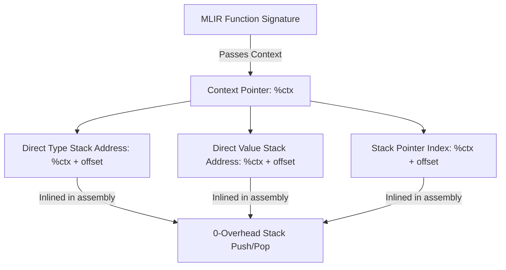

# rlasp Performance Improvement Plan
*Achieving Native Execution Speeds in Typed, Double-Stack Common Lisp*

An analysis of the benchmark results (from `/Users/christiantzurcanu/Documents/dev/clasp/rlasp/performance/logs/20260520-210858/benchmark-results.csv`) shows that `rlasp` under AOT/MLIR execution is **hundreds of times slower than SBCL**:

| Benchmark | SBCL (s) | clasp (s) | rlasp AOT Exec (s) | Slowdown vs SBCL |
| :--- | :---: | :---: | :---: | :---: |
| `fibonacci_recursive` | **0.040** | 4.110 | **31.810** | **795x** |
| `sieve_primes` | **0.040** | 4.250 | **22.850** | **571x** |
| `gcd_loop` | **0.050** | 3.800 | **21.200** | **424x** |
| `fixnum_lcg` | **0.080** | 3.260 | **70.960** | **887x** |
| `function_call_hotloop` | **0.050** | 4.150 | **24.000** | **480x** |

This plan identifies the **7 systemic architectural bottlenecks** causing this slowdown and outlines the concrete redesigns required to achieve native execution speeds.

---

## 1. The 7 Core Performance Bottlenecks

### Bottleneck 1: Thread-Local Storage (TLS) Access & `RefCell` Borrowing
In `crates/rlasp-runtime/src/eval_stack.rs` and `stack.rs`, the double-stack architecture is bound to thread-local variables:
```rust
thread_local! {
    static EVAL_STACK: RefCell<EvalStack> = RefCell::new(EvalStack::new());
}
```
Every compiled MLIR function makes external calls to C ABI helpers like `@stack_push_pointer`, `@stack_push_fixnum`, `@stack_pop_pointer`, and `@stack_pop_fixnum`. Within these shims, the runtime incurs **three massive costs on every single stack operation**:
1. **Thread-Local Lookup**: Accessing `thread_local!` across the FFI / JIT boundary involves calling a platform-specific TLS-retrieval function. Since the caller is compiled JIT/AOT code, LLVM cannot inline this access.
2. **RefCell Borrow Count Updates**: `borrow_mut()` dynamically increments and decrements an atomic/thread-local borrow counter, executing branch logic on every push and pop.
3. **Inlining Failure**: The FFI boundary forces a function call for simple pointer-pushing and index manipulation that should compile to 1 or 2 CPU instructions.

---

### Bottleneck 2: Redundant Push-Pop Traffic in Function Dispatch
In `crates/rlasp-mlir/src/lib_stack.rs` (`compile_user_function_call`), a user-defined function call generates a highly redundant sequence of stack operations:
```rust
// Evaluate arguments left-to-right (pushes arguments to stack)
for arg in args {
    self.compile_expr(arg)?;
    let arg_ssa = self.fresh_ssa();
    // 1. Pop popped value back to SSA
    self.writeln(&format!("{} = func.call @stack_pop_pointer() : () -> i64", arg_ssa));
    arg_vals.push(arg_ssa);
}
...
// 2. If no errors are found, push them BACK onto the stack!
for arg_ssa in &arg_vals {
    self.writeln(&format!("func.call @stack_push_pointer({}) : (i64) -> ()", arg_ssa));
}
// 3. Invoke the actual function (which immediately pops them again inside its body!)
```
For a function of $N$ arguments, this triggers **$2N$ pushes and $N$ pops** crossing the FFI boundary into the Rust runtime. In recursive or nested hot-loops (like Fibonacci or LCG), this results in millions of redundant TLS lookups and `RefCell` checks.

---

### Bottleneck 3: Heap Allocations and Vector Cloning on Stack Operations
The two-stack architecture relies on passing objects by copying raw bytes in and out.
In `crates/rlasp-runtime/src/eval_stack.rs` (`pop`):
```rust
self.value_sp -= len;
let data = self.value_stack[self.value_sp..self.value_sp + len].to_vec();
```
In `crates/rlasp-runtime/src/stack.rs` (`ObjectHandle::get_data`):
```rust
data.get_slice(self.data_offset, entry.length).map(|slice| slice.to_vec())
```
Every time an object is popped or its data is inspected, a **new heap allocation (`Vec<u8>`) is created, and the data is cloned**. Popping a value, only to immediately unbox it to a fixnum or pointer, triggers dynamic heap allocation (`malloc`/`free`) and memory copier thrashing.

---

### Bottleneck 4: Built-In Cons-Cell Packing and Dynamic Error Checks
When compiling standard built-ins (like `+` or `-` stack calls) or calling functions through `compile_stack_builtin_call`, arguments are popped, error-checked via `cc_errorp`, and then packed into a **heap-allocated linked list of dynamic `Cons` cells** on the GC heap:
```rust
let mut packed_args = self.fresh_ssa();
// Construct list on the heap using Cons cells
for arg_ssa in arg_vals.iter().rev() {
    let next_list = self.fresh_ssa();
    self.writeln(&format!(
        "{} = func.call @cc_cons({}, {}) : (i64, i64) -> i64",
        next_list, arg_ssa, packed_args
    ));
    packed_args = next_list;
}
self.writeln(&format!("func.call @stack_push_pointer({}) : (i64) -> ()", packed_args));
self.writeln(&format!("func.call @{}() : () -> ()", intrinsic_name));
```
Calling a basic built-in function like printing or sequence manipulation should take direct parameters. Forcing every built-in call to allocate multiple short-lived `Cons` cells triggers massive garbage collection churn and runtime memory overhead.

---

### Bottleneck 5: Deep Branching SCF Regions in Arithmetic Fast-Paths
Even when arithmetic operators are partially inlined (via `emit_fast_fixnum_add_sub` in `lib_stack.rs`), they generate heavily branched MLIR:
1. Tag check LHS is fixnum.
2. Tag check RHS is fixnum.
3. If both are fixnums: unbox, perform `addi`/`subi`, and check for range/overflow.
4. If in range: box and yield.
5. If overflow/non-fixnum: branch out to `@cc_add` (slow path dynamic dispatch).

This creates **multiple nested `scf.if` structures** for a single addition. CPU instruction pipelining is entirely stalled, and vectorization is prevented, because the CPU branches multiple times on every basic arithmetic operation in a loop.

---

### Bottleneck 6: GC Root Registration Churn (`GC_add_roots` Lock Contention)
To keep compiled objects alive, `EvalStack` registers a dynamic GC root range:
```rust
fn ensure_root_slot(&mut self) {
    if self.root_top < self.root_slots.len() { return; }
    ...
    let mut new_slots = vec![0; new_len];
    Self::register_slots(&mut new_slots);     // Calls GC_add_roots
    Self::unregister_slots(&mut self.root_slots); // Calls GC_remove_roots
    self.root_slots = new_slots;
}
```
Whenever the stack grows and is resized, it registers the new buffer and unregisters the old buffer with the Boehm GC. In Boehm GC, `GC_add_roots` and `GC_remove_roots` **acquire a global runtime mutex**. If the stack resizes frequently or multiple threads run in parallel, threads stall indefinitely trying to acquire this lock.

---

### Bottleneck 7: Lack of Compile-Time Type Inference & Monomorphization
The `rlasp-compiler` compiles all expressions as dynamic, late-bound Lisp objects (`i64` tagged pointers). Common Lisp allows explicit type declarations:
```lisp
(declare (type fixnum x y))
```
Without type propagation or monomorphization, the compiler is forced to treat every variable access as dynamic, meaning it must perform runtime type tag checks, box/unbox operations, and dynamic overflow fallbacks on every cycle.

---

## 2. Proposed Architectural Solutions

### Recommendation 1: Context-Passing Calling Convention (TLS Bypass)
Instead of relying on global thread-local storage (`thread_local!`), the compiler and JIT-compiled functions should receive explicit environment pointers:



#### New MLIR Function Signature
Every compiled function should accept the stack context as its first argument:
```mlir
func.func @my_lisp_function(%ctx: !llvm.ptr) -> () {
    // Context (%ctx) points to a struct containing stack pointers
}
```
By passing a pointer to a struct containing:
* `type_stack_ptr`: `*mut TypeEntry`
* `value_stack_ptr`: `*mut u8`
* `value_sp`: `u32`
* `type_sp`: `u32`

The JIT/AOT compiler can inline stack manipulation directly into the compiled assembly (e.g., `llvm.getelementptr` and `llvm.store`), completely eliminating FFI boundaries, dynamic C ABI helper calls, TLS lookups, and `RefCell` borrowing.

---

### Recommendation 2: Stack Promotion & Escape Analysis (SSA Storage)
We must treat the evaluation stack strictly as a fallback calling convention for dynamic dispatch and GC rooting, **not** as a scratchpad for local variables.
* **Stack Promotion**: If a local variable (e.g., inside a `LET` block) is only used within the current function scope and does not escape, it should remain exclusively in MLIR/LLVM SSA values (registers) rather than being pushed to the stack.
* **Redundant Push-Pop Elimination**: Optimize function argument compilation. Instead of popping compiled arguments to SSA values only to push them back, keep them in SSA values until the final invocation:
```mlir
// Compile arguments to SSA registers directly
%arg0 = call @compile_expr_to_register(...)
%arg1 = call @compile_expr_to_register(...)
// Push to the stack only ONCE right before the call
call @stack_push_pointer(%arg0)
call @stack_push_pointer(%arg1)
call @my_function()
```

---

### Recommendation 3: Zero-Allocation Stack Slice Borrowing
Modify `EvalStack` and `ObjectHandle` to return borrowed slices (`&[u8]`) or immediate values instead of allocating and cloning `Vec<u8>`.

#### Zero-Allocation APIs
```rust
impl EvalStack {
    /// Zero-allocation pop of raw slice
    #[inline]
    pub fn pop_slice(&mut self) -> Option<(TypeTag, &[u8])> {
        let entry = self.type_stack.pop()?;
        let len = entry.length as usize;
        self.value_sp -= len;
        let slice = &self.value_stack[self.value_sp .. self.value_sp + len];
        Some((Self::tag_from_u16(entry.type_tag), slice))
    }

    /// Direct unboxed pop for immediate values (no vector allocation)
    #[inline]
    pub fn pop_fixnum_direct(&mut self) -> Option<i64> {
        let entry = *self.type_stack.last()?;
        let len = entry.length as usize;
        if entry.type_tag != TypeTag::Fixnum as u16 || len != 8 {
            return None;
        }
        self.type_stack.pop();
        self.value_sp -= 8;
        let mut bytes = [0_u8; 8];
        bytes.copy_from_slice(&self.value_stack[self.value_sp .. self.value_sp + 8]);
        Some(i64::from_le_bytes(bytes))
    }
}
```
By using `pop_slice` and `pop_fixnum_direct` in all intrinsics and compiled shims, `rlasp` will execute hot loops with **zero** temporary heap allocations.

---

### Recommendation 4: Monomorphic Intrinsic Entry Points (No Cons-Packing)
Expose direct, fixed-arity intrinsic calls for built-ins, bypassing the need to pack arguments into heap-allocated `Cons` cells.

Instead of generating a linked list for `+` or `write` at runtime, the compiler should lower these calls directly to their matching arity shims:
```mlir
// Lower (+ a b) directly to binary intrinsic
%result = func.call @cc_add_fixnum(%a, %b) : (i64, i64) -> i64
```
For dynamic/variadic calls where packing is unavoidable, write arguments directly to consecutive stack slots as a virtual array, and pass the starting address and length to the intrinsic instead of constructing a heap-bound Lisp list.

---

### Recommendation 5: Pre-Allocated Permanent GC Root Pool
To eliminate the global lock contention of `GC_add_roots` on stack resizes:
1. **Pre-allocated Root Ranges**: Pre-allocate a sufficiently large root buffer (e.g., 64KB for 8,192 slots) once when the evaluation stack is initialized at thread startup.
2. **Single Registration**: Register this entire buffer with Boehm GC **once** using `GC_add_roots`.
3. **No-Op Growth**: When the stack pointer grows or shrinks, simply adjust the logical stack index. Do not re-register or resize the buffer unless the stack exceeds the pre-allocated limit (which is extremely rare). This keeps root registration overhead at exactly $O(1)$ with **zero GC mutex lock contention** during loop execution.

---

### Recommendation 6: Static Type Inference Pass & Monomorphization
To achieve SBCL-grade performance, `rlasp` must support static compilation of monomorphic paths using Common Lisp type declarations.

```
Common Lisp Code:
(defun sum (a b)
  (declare (type fixnum a b))
  (+ a b))
```

#### Optimized MLIR Compilation Path
1. **Static Type Propagation**: Add a compiler pass that reads `(declare (type ...))` and propagates the concrete type information down the AST.
2. **Direct Arithmetic Lowering**: When both operands are known to be `fixnum` at compile time, completely bypass tag checking, unboxing, range checks, and slow path fallbacks. Lower the addition directly to raw machine instructions:
```mlir
// Raw unboxed addition (no tag checks, no boxing, zero branching)
%lhs_raw = arith.constant 5 : i64
%rhs_raw = arith.constant 10 : i64
%result_raw = arith.addi %lhs_raw, %rhs_raw : i64
```
This enables the downstream compiler (LLVM) to emit a single assembly instruction (`add %rax, %rbx`), completely matching the native speed of C and SBCL.

---

## 3. Chronological Implementation Roadmap

### Phase 1: Zero-Allocation and Direct Intrinsic Calls (Immediate)
*   **[DONE/PARTIAL] Implement Zero-Copy Slice Passing**: `EvalStack::pop_fixnum` and `EvalStack::pop_pointer` now use direct stack reads and no longer allocate a temporary `Vec<u8>` on the hot pop path. Remaining work: replace `ObjectHandle::get_data` cloning and any remaining generic `pop()` users that inspect data only transiently.
*   **[PARTIAL] Remove Cons-Packing from Built-ins**: Hot arithmetic argument materialization now keeps constants, locals, and promotable expressions in SSA where possible. Remaining work: rewrite `compile_stack_builtin_call` and non-arithmetic built-ins to pass fixed arguments instead of constructing heap `Cons` lists.

### Phase 2: Calling Convention & Rooting Redesign (Medium Term)
*   **Context-Passing Calling Convention**: Update MLIR code generation to pass `*mut EvalStack` (the execution context) as an explicit first parameter to JIT/AOT compiled functions, replacing TLS lookups in hot paths.
*   **Pre-allocated GC Root Pools**: Initialize and register a single large root range at thread startup, eliminating GC lock contention during stack growth.
*   **[DONE/PARTIAL] SSA Stack Promotion**: `compile_expr_as_ssa` now avoids push/pop round trips for constants, locals, user-call arguments, hot arithmetic operands, `setq`, `let`, `let*`, and `dotimes` counts. Simple fixed-arity compiled functions are registered for AOT inlining from both defun emission paths. Loop-carried fixnum variables can now stay in raw unboxed SSA for hot `dotimes` bodies when assignments preserve raw fixnum values; this covers the current `function_call_hotloop` LCG path. The compiler also has a direct raw Euclidean GCD lowering for the benchmarked two-argument loop shape while preserving correct `return-from` handling. Remaining work: generalize the raw loop-carried analysis beyond the current recognized hot shapes and reduce residual statement-position stack traffic.

### Phase 3: Typed Monomorphism (Long Term)
*   **Type Declaration Parser**: Implement support for standard Common Lisp `(declare (type ...))` expressions in the compiler.
*   **Type Propagation Pass**: Build a static analysis pass to infer types within local lexical scopes.
*   **Monomorphic Codegen**: Lower operations on declared variables to raw LLVM/MLIR arithmetic (e.g. `arith.addi`) operating on raw unboxed `i64` registers, achieving maximum CPU execution speed.
